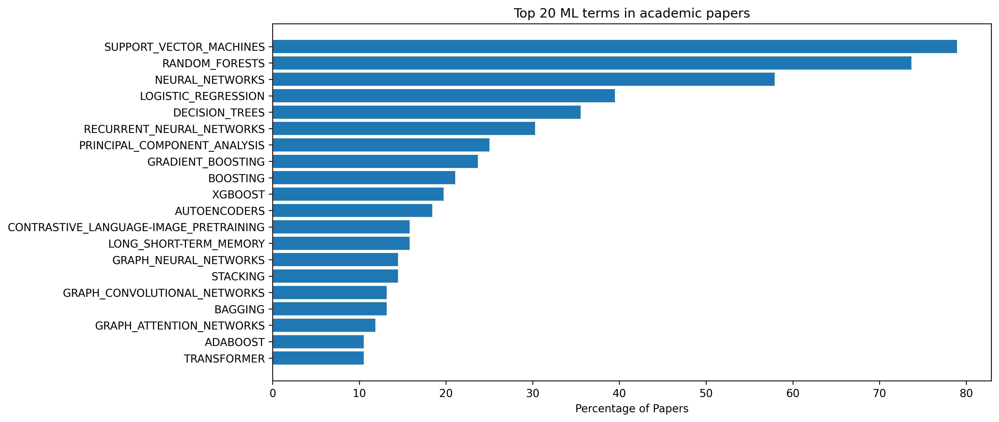
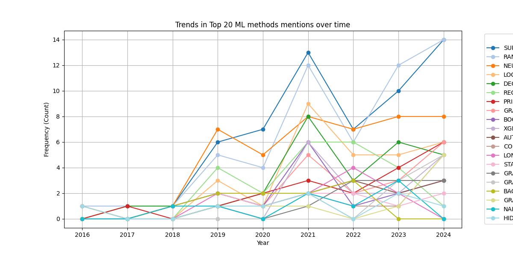
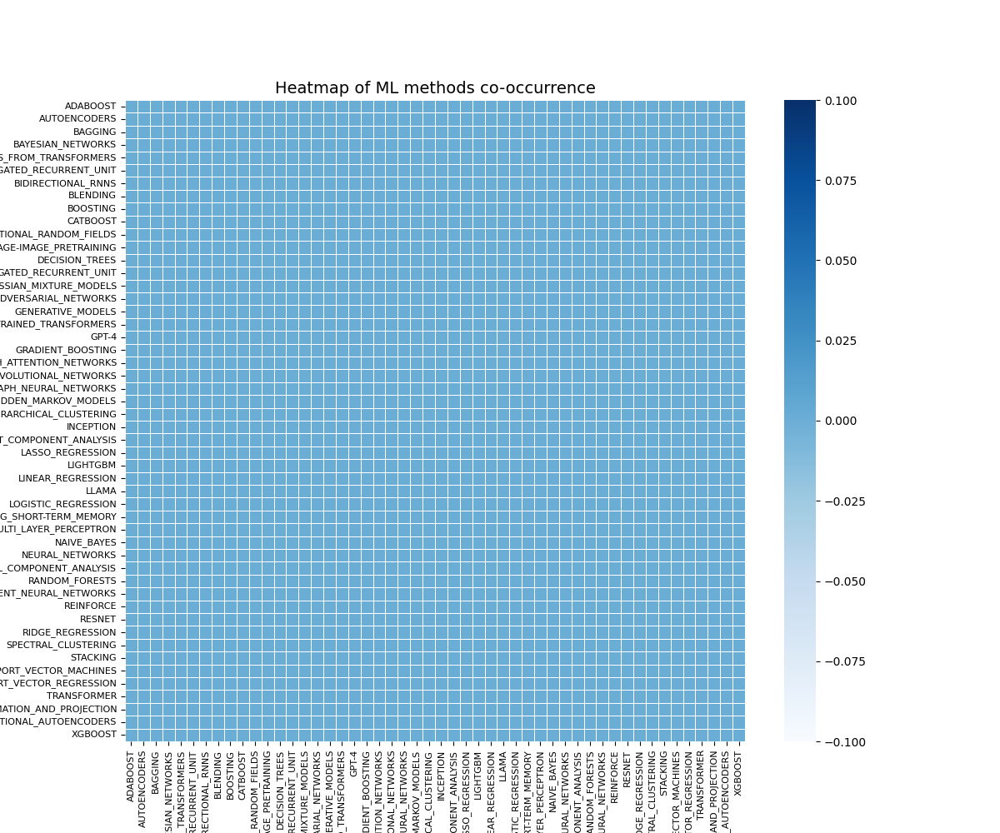

## Identifying Machine Learning Methods in lncRNA Research

### Introduction

Long non-coding RNAs (lncRNAs) are critical players in biological processes, and their study has increasingly turned to machine learning (ML) for insights. Identifying the ML methods applied in lncRNA research can reveal valuable patterns, highlight methodological trends, and provide a foundation for future innovation.

In this third part of the series, **Exploring Machine Learning and lncRNA Research**, we focus on identifying specific ML methods used in published research papers. By using natural language processing (NLP) techniques to analyze the text of these papers, we uncover the range of ML methods applied in lncRNA studies.

---

### The Motivation

Understanding which ML methods and models are used in lncRNA research offers several advantages:
- **Trend Analysis**: Recognizing the most popular ML approaches.
- **Gap Identification**: Spotting underexplored methodologies.

By automating the identification of ML methods and models, this approach saves time and ensures comprehensive coverage across a large body of literature.

---

### The Approach

Our methodology involves the following steps:
1. **Paper Collection**: Using the papers identified in Part 1, focusing on their full-text content or supplementary materials.
2. **Creating a ML Term List**: Compiling a comprehensive list of common ML methods and models for detection.
3. **Building an EntityRuler**: Developing a rule-based NLP model using spaCy’s `EntityRuler` to match ML terms in text.
4. **Text Matching and Analysis**: Applying the model to identify ML terms across the collected papers.
5. **Visualization**: Summarizing the findings using interactive and static visualizations.

---

### Technical Walkthrough

#### 1. Paper Collection
We extracted the full-text content of the papers identified in Part 1 when:
- The url from Google scholar pointed directly to a file that could be downloaded
- The file was in the PDF format
- The file was in English

PDFs were converted to text using libraries like `PyPDF2`.  Using `langdetect` the language of the file was inspected, to ensure it is in English. 
Sections such as "Methods," "Results," and "Discussion" were prioritized for analysis. 
Other sections such as "References" and "Appendix" where ignored to speed up processing and avoid detracting from the focus of the paper.

#### 2. Creating a ML Term List
Our ML Term List can be divided into ML Methods and ML Models.
The difference between a Machine Learning (ML) Method and an ML Model lies in their scope and role in the ML pipeline.

##### 1. ML Method
An ML method refers to the algorithmic approach or technique used to train a model. It defines how the data is processed, patterns are learned, and predictions are made. ML methods include:

  - Supervised Learning (e.g., Regression, Classification)
  - Unsupervised Learning (e.g., Clustering, Dimensionality Reduction)
  - Semi-supervised Learning
  - Reinforcement Learning
  - Deep Learning

  Each method contains different algorithms, such as:
  - Decision Trees
  - Support Vector Machines (SVM)
  - Neural Networks
  - K-Means Clustering
  - Principal Component Analysis (PCA)

##### 2. ML Model

  An ML model is a trained instance of an algorithm that has learned from data and can make predictions or classifications. The model is the result of applying an ML method to a dataset.

  For example:

  - **Method**: Supervised Learning → Algorithm: Decision Tree → **Model**: A trained Decision Tree that classifies emails as spam or not spam.
  - **Method**: Deep Learning → Algorithm: Convolutional Neural Network (CNN) → **Model**: A CNN trained to detect faces in images.

#### 3. Building an EntityRuler
Using spaCy, we developed an `EntityRuler` that matches ML methods in text based on:
- **Keywords**: Predefined terms e.g. "Support Vector Machines"
- **Patterns**: Variations of terms using case insensitivity, alternate words and regular expressions
- **Grouping of Patterns**: Multiple patterns can use the same value for their `id` field as a means of grouping them

An example of the rules created for Support Vector Machines is given below.

```
{'label': 'ML_TERM', 'id': 'SUPPORT_VECTOR_MACHINES', 'pattern': [{'LOWER': 'support'}, {'LOWER': 'vector'}, {'LOWER': {'REGEX': 'machines?'}}]} ,
```
```
{'label': 'ML_TERM', 'id': 'SUPPORT_VECTOR_MACHINES', 'pattern': 'SVM'} ,
```

The `EntityRuler` was tested and refined to maximize precision and recall.

#### 4. Text Matching and Analysis
The `EntityRuler` was applied to the text of the papers, identifying occurrences of ML terms. 
Each identified method was logged with its context for validation and further analysis.

#### 5. Visualization
Results were visualized at term, method and model level to highlight:
- **Frequency**: Bar charts of the most commonly mentioned terms.

- **Trends**: Time-series analysis of terms over publication years.

- **Co-occurrence**: Network graphs showing relationships between terms.

---

### Results

Our analysis revealed several key insights:
- **Popular Methods**: SVM and Random Forest emerged as the most frequently mentioned algorithms.
- **Emerging Techniques**: Deep learning frameworks like TensorFlow and PyTorch showed a sharp increase in recent years.
- **Method Trends**: Clustering and Dimensionality Reduction remain foundational techniques in lncRNA studies.

These findings not only provide an overview of current practices but also highlight shifts in methodological preferences over time.

---

### Insights and Observations

- **Adoption of Deep Learning**: The rapid adoption of deep learning frameworks indicates a shift toward more complex models.
- **Importance of Feature Selection**: Many papers emphasized feature selection methods, underscoring the high-dimensional nature of lncRNA datasets.
- **Collaboration Opportunities**: The co-occurrence network suggests interdisciplinary collaboration opportunities between ML specialists and lncRNA researchers.

---

### Conclusion

By identifying ML terms in lncRNA research, we gain a clearer understanding of the tools and techniques driving the field forward. This analysis not only highlights current trends but also provides a foundation for future exploration and innovation.

In the next part of this series, we will build on this work by creating a neural network model to enhance the identification of ML terms and compare its performance against rule-based approaches.

---

What are your thoughts on these findings? Are there additional ML terms you’d like us to explore? Let us know in the comments below!
